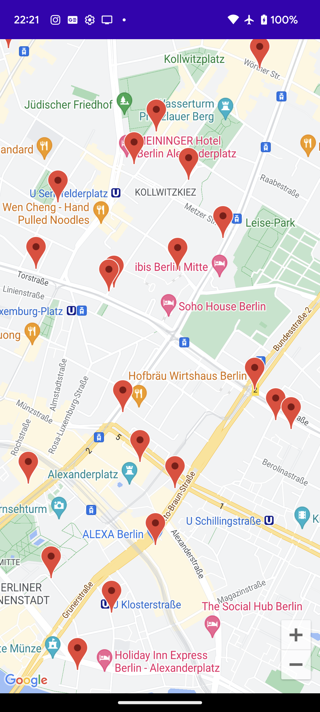
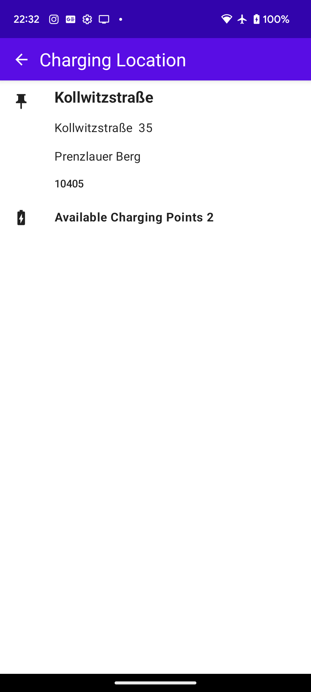

## GoogleMaps + OpenCharge API

# Pre-requisite 📝

In your `local.properties` you will need to add your Google Maps API key and the Open Charge Key in the pdf
```
MAPS_API_KEY= YOUR KEY
OPEN_CHARGE_API= YOUR KEY
```
See [Get your api key](https://developers.google.com/maps/documentation/android-sdk/get-api-key)

# Screenshots 📱

 

